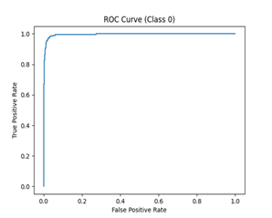

# Esophageal Cancer Detection using Deep Learning

## 📌 Overview
This project focuses on detecting gastrointestinal diseases using deep learning techniques. The system classifies endoscopic images into multiple categories using ResNet-18 and MobileNetV2 architectures.

---

## Features
-  Deep learning classification using ResNet-18
-  Model comparison with MobileNetV2
-  ROC-AUC analysis (AUC ≈ 0.99)
-  Precision, Recall, F1-score evaluation
-  Grad-CAM visualization for explainability
-  GUI-based prediction system

---

## Models Used
- ResNet-18 (Primary model)
- MobileNetV2 (Lightweight comparison)

---

## Results
| Model        | Accuracy | F1 Score | AUC |
|-------------|---------|----------|-----|
| ResNet-18   | ~93%    | ~0.92    | ~0.95 |
| MobileNetV2 | ~90%    | ~0.90    | **0.99** |

---

## Sample Outputs
- ROC Curve
- Grad-CAM Heatmaps
- Confusion Matrix

---

## Tech Stack
- Python
- PyTorch
- OpenCV
- Tkinter
- Matplotlib

---
##  Results & Visualizations

### ROC Curve


### Grad-CAM Visualization


### GUI Output

---

##  How to Run
```bash
python cancer_gui.py

